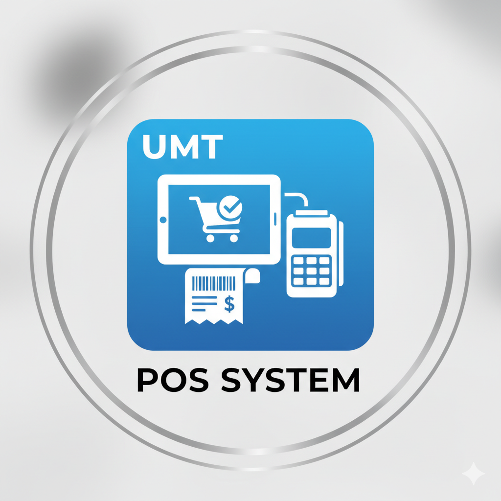

# UMT-POS-SYSTEM

[![Contributors][contributors-shield]][contributors-url]
[![Forks][forks-shield]][forks-url]
[![Stargazers][stars-shield]][stars-url]
[![Issues][issues-shield]][issues-url]
[![License][license-shield]][license-url]

<br />
<div align="center">
  

<h3 align="center">UMT POS SYSTEM</h3>

  <p align="center">
    A C-based Point-of-Sale (POS) system for the UMT Programming Bookstore. This application enables efficient management of book sales, discount calculations, and daily sales reporting in a console environment.
    <br />
    <a href="https://github.com/LoveDoLove-School-Projects/UMT-POS-SYSTEM"><strong>Explore the docs »</strong></a>
    <br />
    <br />
    <a href="https://github.com/LoveDoLove-School-Projects/UMT-POS-SYSTEM">View Demo</a>
    &middot;
    <a href="https://github.com/LoveDoLove-School-Projects/UMT-POS-SYSTEM/issues/new?labels=bug&template=bug-report---.md">Report Bug</a>
    &middot;
    <a href="https://github.com/LoveDoLove-School-Projects/UMT-POS-SYSTEM/issues/new?labels=enhancement&template=feature-request---.md">Request Feature</a>
  </p>
</div>

<details>
  <summary>Table of Contents</summary>
  <ol>
    <li><a href="#about-the-project">About The Project</a></li>
    <li><a href="#features">Features</a></li>
    <li><a href="#getting-started">Getting Started</a></li>
    <li><a href="#usage">Usage</a></li>
    <li><a href="#contributing">Contributing</a></li>
    <li><a href="#license">License</a></li>
    <li><a href="#contact">Contact</a></li>
    <li><a href="#acknowledgments">Acknowledgments</a></li>
  </ol>
</details>

## About The Project

UMT-POS-SYSTEM is a console-based POS application designed for the UMT Programming Bookstore. It allows users to view available books, process sales orders, apply discounts based on purchase amount, and generate daily sales summary reports. The project is implemented in C and is intended for educational and practical use in managing bookstore transactions.

### Features

- Console-based menu navigation
- Book selection across multiple categories
- Dynamic discount calculation (5%, 10%, 15%) based on total purchase
- Receipt and daily sales summary generation
- User-friendly prompts and error handling

## Getting Started

To set up and run UMT-POS-SYSTEM locally, follow these steps:

### Prerequisites

- Microsoft Visual Studio (2019 or later recommended)
- Windows OS

### Installation

1. Clone the repository:
   ```sh
   git clone https://github.com/LoveDoLove-School-Projects/UMT-POS-SYSTEM.git
   ```
2. Open `AssignmentsPCD.sln` in Visual Studio.
3. Build the solution (Ctrl+Shift+B).
4. Run the project (F5 or via Debug > Start Debugging).

## Usage

- On launch, the program displays a welcome message and main menu.
- Options include viewing the book menu, placing a sales order, and exiting.
- Book categories: Software Development, CyberSecurity, Interactive Software Technology.
- Select books and quantities, confirm orders, and view receipts.
- Discounts are applied automatically based on total purchase amount.
- At the end of the session, a daily sales summary report is generated.

Refer to the source code (`AssignmentsPCD/main.c`) for detailed logic and menu navigation.

## Contributing

Contributions are welcome! To contribute:

1. Fork the repository
2. Create a feature branch (`git checkout -b feature/AmazingFeature`)
3. Commit your changes (`git commit -m 'Add some AmazingFeature'`)
4. Push to the branch (`git push origin feature/AmazingFeature`)
5. Open a Pull Request

Please use formal language and follow best practices. For suggestions, open an issue with the tag "enhancement".

## License

Distributed under the MIT License. See `LICENSE` for details.

## Contact

LoveDoLove - [GitHub](https://github.com/LoveDoLove-School-Projects)

Project Link: [https://github.com/LoveDoLove-School-Projects/UMT-POS-SYSTEM](https://github.com/LoveDoLove-School-Projects/UMT-POS-SYSTEM)

## Acknowledgments

- [Best-README-Template](https://github.com/othneildrew/Best-README-Template)
- UMT Programming Bookstore
- Microsoft Visual Studio

<!-- MARKDOWN LINKS & IMAGES -->

[contributors-shield]: https://img.shields.io/github/contributors/LoveDoLove-School-Projects/UMT-POS-SYSTEM.svg?style=for-the-badge
[contributors-url]: https://github.com/LoveDoLove-School-Projects/UMT-POS-SYSTEM/graphs/contributors
[forks-shield]: https://img.shields.io/github/forks/LoveDoLove-School-Projects/UMT-POS-SYSTEM.svg?style=for-the-badge
[forks-url]: https://github.com/LoveDoLove-School-Projects/UMT-POS-SYSTEM/network/members
[stars-shield]: https://img.shields.io/github/stars/LoveDoLove-School-Projects/UMT-POS-SYSTEM.svg?style=for-the-badge
[stars-url]: https://github.com/LoveDoLove-School-Projects/UMT-POS-SYSTEM/stargazers
[issues-shield]: https://img.shields.io/github/issues/LoveDoLove-School-Projects/UMT-POS-SYSTEM.svg?style=for-the-badge
[issues-url]: https://github.com/LoveDoLove-School-Projects/UMT-POS-SYSTEM/issues
[license-shield]: https://img.shields.io/github/license/LoveDoLove-School-Projects/UMT-POS-SYSTEM.svg?style=for-the-badge
[license-url]: https://github.com/LoveDoLove-School-Projects/UMT-POS-SYSTEM/blob/main/LICENSE
